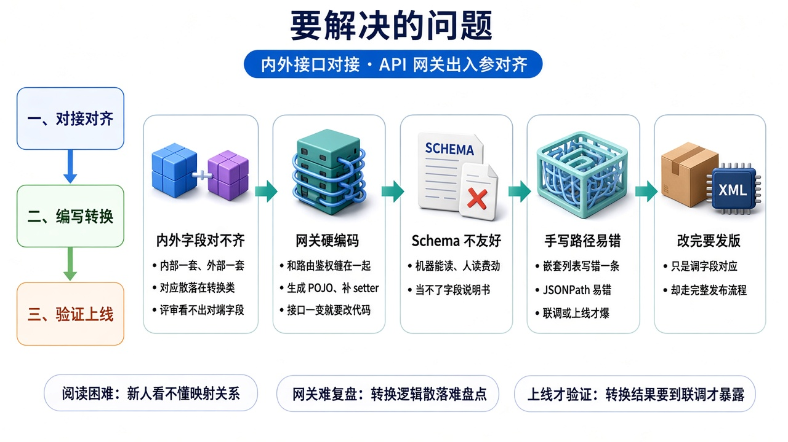
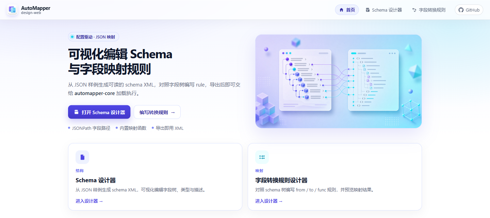
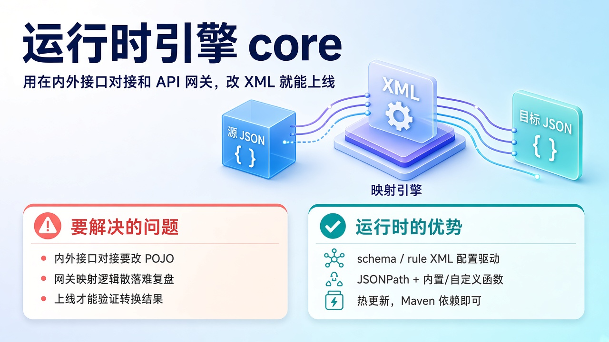

<h1 align="center">auto-mapper</h1>

<strong>配置驱动的 JSON 字段映射</strong>

内部服务互调 · 外部 / 第三方对接 · API 网关出入参

---

**内外系统对接、API 网关出入参对齐** 时，最烦的往往不是业务本身，而是两边 JSON 长得不一样：字段名不同、层级不同，还夹杂格式和字典转换。传统做法是生成 POJO、手写一层层 getter / setter，接口一改就要跟着改代码、重新发版。

**auto-mapper** 把「报文长什么样」和「字段怎么对应」抽成可读的配置：同一套 schema / rule，人可以评审，Java 运行时可以直接执行。适合 **内部服务互调、对接外部/第三方接口，以及 API 网关里的入参出参转换**。接口变了，优先改配置，而不是改一堆胶水代码。

---

## 配套模块

| | 给谁用 | 做什么 |
|---|--------|--------|
| **可视化设计器** | 对接、网关配置、测试、评审的人 | 对着字段树配结构和映射，导出 XML |
| **文档生成 skill** | 拿到接口文档就要出配置的人 | 截图 / 文本 / Word 生成 schema、JSON 样例，双侧再出 rule |
| **运行时 core** | 业务工程 / 网关 | 加载 XML，把源数据映射成目标 JSON |

---

## 要解决的问题

- **内外接口字段对不齐。** 内部模型一套，外部网关或第三方又是另一套，对应关系散落在转换类里，新人看不懂，评审也很难一眼看出「哪个字段进了对端」。
- **网关出入参靠硬编码。** API 网关、接口编排里为了对齐报文去生成 Java 类、补 setter，和真正的路由、鉴权逻辑缠在一起，接口一变就要改代码。
- **标准 JSON Schema 不友好。** 机器能读，人读起来费劲，不适合当「字段说明书」给产品和运维看。
- **手写 XML / 路径容易错。** 嵌套列表、JSONPath 写错一条，往往到联调或上线才爆。
- **改完要发版才生效。** 很多时候只是调字段对应，却不得不走完整发布流程。

---

## 可视化设计器

给「配映射的人」用：打开浏览器就能维护字段树和转换规则，**不必先啃 XML，也不必先写 Java**。内部接口、外部对接、网关出入参，都可以在同一套树上配清楚。启动方式与页面说明见 **[automapper-design-web/README.md](automapper-design-web/README.md)**。

**能做什么**

- 丢一份 JSON 样例，自动生成字段树（名称、类型、嵌套），再按需改、导出 schema。
- 对照结构树编写映射：从哪来、到哪去，需要时加上转换函数和固定值。
- 在页面上预览映射结果，减少「导出以后才发现路径写错」。
- 产物就是普通 XML，和运行时使用同一套约定，静态部署即可，不绑后端。

**好在哪里**

结构给人看、给版本管理看；规则可以点选路径而不是凭记忆手打。设计器只管「配清楚」，真正执行仍由 core 完成——网关或业务服务加载同一份文件即可。

---

## 文档生成 skill

给「手里已经有接口文档」的人用：截图、纯文本、Word 里的字段表，不必先在设计器里从零点树。每个接口一套产物，自动判断源和目标；两侧都在时再出 rule。约定与命令见 **[automapper-skill/README.md](automapper-skill/README.md)**。

**能做什么**

- 从文档抽出字段表，生成目标形态的 schema XML 和 JSON 样例。
- 同时识别到内部源和对端目标时，按同名和常见别名写出 rule（列表先初始化，再映叶子）。
- 多接口文档按接口拆开，各出各的目录，不揉成一份配置。
- 只有一侧报文时只出 schema 和样例，不强行编映射。

**好在哪里**

文档进、配置出，和设计器、core 用同一套 schema / rule 约定。生成结果可以再丢进设计器里改，也可以直接交给运行时加载。

---

## 运行时 core

给「跑在服务或网关里的代码」用：工程依赖这一个模块，用 schema 编号和 rule 编号做一次映射，得到目标 JSON。

**能做什么**

- 读懂 schema / rule，按 JSONPath 取值、赋值。
- JSONPath 不够时，走内置转换（建列表、设值、日期格式、字典等），也可以挂自己的函数。
- 配置放在约定目录里，支持文件热更新：调内外接口或网关字段对应，不必次次发版。
- 输出就是目标结构的 JSON，方便网关、编排、第三方对接直接往下传。

**好在哪里**

映射规则和业务代码解耦，XML 可 diff、可回滚；复杂转换集中在函数里，而不是复制粘贴一段段 if-else。细节见 [automapper-core 说明](automapper-core/README.md)。

---

## 这套工具的优点

1. **按场景拆得开。** 内部服务互调、外部/第三方对接、API 网关出入参，都是「两套 JSON 对齐」这一件事，用同一套配置做完。
2. **配置即文档。** schema 说明「长什么样」，rule 说明「怎么对应」，评审和排障不用翻 Java。
3. **改映射不等于改代码。** 多数字段调整，改 XML（或在设计器里改完导出）即可，运行时按编号加载。
4. **人和机器用同一份文件。** 设计器降低编写门槛，skill 从文档起草，core 保证执行语义；不必维护两套互不同步的「文档 vs 实现」。
5. **扩展点清楚。** 简单对应走路径；格式、字典、拼装走函数；再复杂就自定义函数，而不是把特例写回网关或业务里。

落地时通常准备三样东西：一份目标形态的 JSON 样例、一份 schema、一份 rule。可以从接口文档用 skill 先起草，再在设计器里核对；运行时按编号选用，转换结果就是对端或网关下游要的 JSON。

---

## 仓库里有什么

| 目录 | 用途 |
|------|------|
| [`automapper-design-web/`](automapper-design-web/README.md) | 可视化设计器 |
| [`automapper-core/`](automapper-core/README.md) | Java 运行时 |
| [`automapper-skill/`](automapper-skill/README.md) | 从接口文档生成 schema、JSON 样例、rule |
| [`docs/`](docs) | 本页说明图 |
